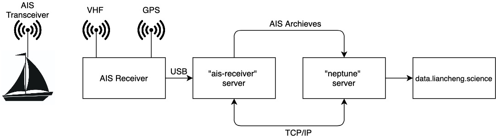
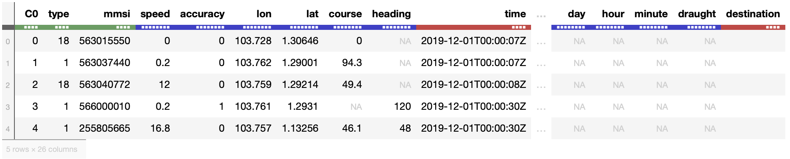

# AIS-based Vessel Trajectory Prediction
This is a final project developed as part of master degree requirement at Computer Science Department of NUS. The project attempts to perform machine learning analysis with a huge dataset, called AIS data, generated by vessels when passing through *The Singapore Straits* during the course of 2019 calender year.

**Table of Content**
- [AIS-based Vessel Trajectory Prediction](#ais-based-vessel-trajectory-prediction)
  - [Introduction](#introduction)
  - [AIS Data Collection](#ais-data-collection)
  - [Exploratory Data Analysis](#exploratory-data-analysis)
    - [Data Description](#data-description)
    - [Data Preprocessing](#data-preprocessing)

## Introduction
Singapore maintains its position as the leading maritime capital in the world for being tops in three pillars including Shipping, Ports and Logistics, Attractiveness and Competitiveness, and for the remaining pillars, Singapore is ranked as top 10 cities. As Singapore continues to become one of the world’s busiest port in the world, the Maritime Port Authority (MPA) needs to enhance maritime security at Singapore water against dangerous adversaries such as piracy attacks, armed robbery, crew abduction, or smuggling. 

The challenges of sea surveillance in Singapore water are due to its size and vessel movements traffic. Nearly 100,000 vessels pass through the 105-km long waterway each year, accounting for about a quarter of the world’s trade good. Our system records the average of 1 million vessels message in a day, leading to about 800 vessels information to keep track per minute. Those number makes it challenging for coastal police guard to patrol the vessels only when the accident takes place, hence there is a need of technology to predict the future location of vessels based on their history of movements.

A standard way of sending information about ship movement is through the Automatic Identification System (AIS). AIS dataset is used for analysis and machine learning training and testing throughout this project.

## AIS Data Collection
The School of Computing at the National University of Singapore designed and implemented an end-to-end solution for AIS data collection as shown in below picture, and made them publicly available in [data.liancheng.science](www.data.liancheng.science). 

## Exploratory Data Analysis
### Data Description
AIS data packet is encoded as follows: `!AIVDM,1,1„B,177KQJ5000G?tO‘K>RA1wUbN0TKH,0*5C`. Each field is separated by a comma as there are 7 fields in the packet. The actual payload message that we are interested in is field 6: `177KQJ5000G?tO‘K>RA1wUbN0TKH`. This website [gpsd.gitlab.io](https://gpsd.gitlab.io/gpsd/AIVDM.html) is helpful in interprating the AIS payload. The data in AIS payload is an ASCII-encoded bit vector. Each character represents 6-bits of data from which can be recovered by subtracting 48 to its ASCII value. For instance, the 6-bits interpretation of the first 4 characters in the above AIS payload is `000001 000111 000111 011011`. By concatenating all 6-bits representation of each AIS payload character, we end up with a binary sequence of AIS payload.

The first 6 bits of the binary payload are the message type. There are 27 message types in total, but in practice the most common types emit by AIS transmitter are type 1, 3, 4, 5, 18, and 24. Type 1, 3, 4, and 18 transmit position-related information while type 5 and 24 transmit static and voyage related information. In normal operation, an AIS transceiver broadcasts a new position-related message every 2 to 10 seconds while underway and every 3 minutes while stationary. Additionally, a new static/voyage related message is sent every 6 minutes. The periodicity of AIS message mentioned just now never happen in a real case. **Most of the time the data is erroneous and irregular**.

The following table is a snapshot of what AIS data looks like after being decoded from the payload. 

### Data Preprocessing

